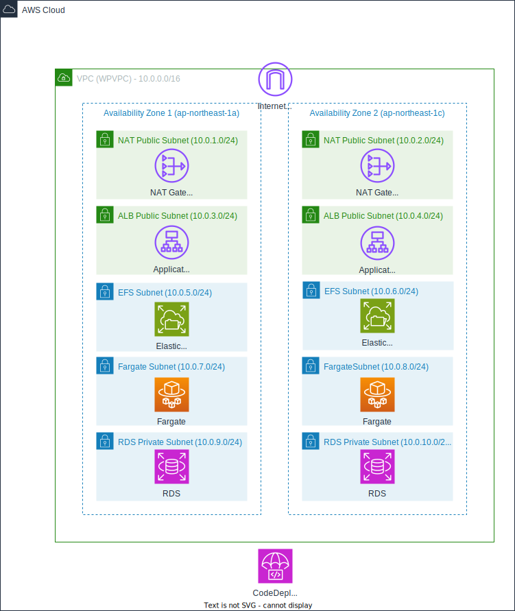

# ECSを使ったWordPress構築ハンズオン

このハンズオンでは、AWS ECS（Elastic Container Service）を使用してWordPressを構築する方法を学びます。コンテナ技術を活用したWebアプリケーションのデプロイ方法と、Blue/Greenデプロイメントによるバージョンアップの方法を体験できます。

## 前提条件

- AWSアカウントを持っていること
- AWSマネージドコンソールにアクセスできること
- 東京リージョン（ap-northeast-1）を使用すること

## 作るもの

見にくいので、矢印ははしょってます


| コンポーネント   | 説明                                                         |
|------------------|--------------------------------------------------------------|
| **NAT Gateway**   | Wordpressが外部と通信するために作成されます。                |
| **ALB**           | 複数のWordpressインスタンス用のロードバランサーで、ブルーグリーンデプロイメントに必要です。 |
| **EFS**           | Wordpressの`wp-content`を保存するためのストレージ。これがないとファイルが複数インスタンス間で共有できません。 |
| **Fargate**       | Wordpressインスタンスを構築・管理するためのコンテナサービスです。 |
| **RDS**           | Wordpressのデータベース（MySQL）を提供するサービスです。    |


## 1. VPCの作成

まずはCloudFormationを使って、必要なVPC、サブネット、セキュリティグループなどのネットワークリソースを一括で作成します。

1. 以下のURLをクリックして、CloudFormationのクイック作成画面に移動します。

```
https://ap-northeast-1.console.aws.amazon.com/cloudformation/home?region=ap-northeast-1#/stacks/quickcreate?templateURL=https%3A%2F%2Fs3.ap-northeast-1.amazonaws.com%2Fcf-templates-nxbtnduaoqyw0-ap-northeast-1%2Ftemplate-1740722027707.yaml&stackName=jawsugniigata21
```

2. スタック名が「jawsugniigata21」になっていることを確認します。
3. 画面下部の「スタックの作成」ボタンをクリックします。
4. スタックの作成が完了するまで待ちます（約5分程度）。

## 2. RDSの作成

WordPressのデータを保存するためのMySQLデータベースをRDSで作成します。

### 2.1 サブネットグループの作成

1. [RDSコンソール](https://ap-northeast-1.console.aws.amazon.com/rds/home?region=ap-northeast-1#)に移動します。
2. 左側のナビゲーションペインから「サブネットグループ」を選択します。
3. 「DB サブネットグループを作成」ボタンをクリックします。
4. 以下の情報を入力します：
   - 名前: `wordpress-subnet-group`
   - 説明: `Subnet group for WordPress RDS`
   - VPC: `WPVPC`（CloudFormationで作成したVPC）
   - アベイラビリティーゾーン: `ap-northeast-1a`と`ap-northeast-1c`を選択
   - サブネット: `RDSSubnet1`と`RDSSubnet2`を選択（CIDRが10.0.9.0/24と10.0.10.0/24のもの）
5. 「作成」ボタンをクリックします。

### 2.2 データベースの作成

1. RDSコンソールの左側のナビゲーションペインから「データベース」を選択します。
2. 「データベースの作成」ボタンをクリックします。
3. 以下の設定でデータベースを作成します：

**データベース作成方法**
- 標準作成を選択

**エンジンのオプション**
- エンジンタイプ: `MySQL`
- バージョン: `MySQL 8.0.40`

**テンプレート**
- 無料利用枠を選択

**設定**
- DB インスタンス識別子: `wordpress-db`
- マスターユーザー名: `admin`
- マスターパスワード: 自動生成を選択するし、表示されたパスワードをメモしておく

**インスタンス設定**
- DB インスタンスクラス: バースト可能クラス `db.t4g.micro`

**ストレージ**
- ストレージタイプ: `汎用 SSD (gp2)`
- 割り当てられたストレージ: `20 GiB`

**接続**
- コンピューティングリソースに接続しない
- Virtual Private Cloud (VPC): `WPVPC`
- サブネットグループ: `wordpress-subnet-group`（先ほど作成したもの）
- パブリックアクセス: `なし`
- VPC セキュリティグループ: 既存の選択
  - 既存のセキュリティグループ: `RDSSecurityGroup`（CloudFormationで作成したもの）

**データベース認証**
- パスワード認証を選択

**追加設定**
- 初期データベース名: `wordpress`
- バックアップ: 自動バックアップを無効化
- その他のオプションはデフォルトのまま

4. 「データベースの作成」ボタンをクリックします。
5. 上部バナーの「認証情報の詳細を表示」クリックし、表示されたパスワードをメモしておきます。
6. データベースの作成が完了したら、詳細を開いて**エンドポイント**をメモしておきます。

## 3. IAMロールの作成

CodeDeployがECSにデプロイするために必要なロールを作成します。

1. [IAMコンソール](https://console.aws.amazon.com/iam/home?region=ap-northeast-1#/home)に移動します。
2. 左側のナビゲーションペインから「ロール」を選択します。
3. 「ロールの作成」ボタンをクリックします。
4. 以下の設定でロールを作成します：

**信頼されたエンティティタイプ**
- AWS サービスを選択

**ユースケース**
- 「CodeDeploy」を選択し、その中から「CodeDeploy - ECS」を選択

**アクセス許可ポリシー**
- `AWSCodeDeployRoleForECS`が自動的に選択されていることを確認

**ロールの詳細**
- ロール名: `CodeDeployECSRole`
- 説明: そのまま

5. 「ロールの作成」ボタンをクリックします。

## 4. EFSの作成

WordPressのアップロードファイルなどを永続化するためのEFSを作成します。

1. [EFSコンソール](https://ap-northeast-1.console.aws.amazon.com/efs/home?region=ap-northeast-1#/file-systems)に移動します。
2. 「ファイルシステムの作成」ボタンをクリックします。
3. 「カスタマイズ」をクリックし、以下の設定でファイルシステムを作成します：

**全般**
- 名前: `wordpress-efs`
- 自動バックアップ: 無効化

**ネットワークアクセス**
- VPC: `WPVPC`
- マウントターゲット:
  - アベイラビリティーゾーン: `ap-northeast-1a`
    - サブネット: `EFSPublicSubnet1`
    - セキュリティグループ: `EFSSecurityGroup`
  - アベイラビリティーゾーン: `ap-northeast-1c`
    - サブネット: `EFSPublicSubnet2`
    - セキュリティグループ: `EFSSecurityGroup`

**ファイルシステムポリシー**
そのまま

4. 「作成」ボタンをクリックします。
5. 作成されたファイルシステムの**ファイルシステムID**をメモしておきます。

## 5. ECSクラスタの作成

1. [ECSコンソール](https://ap-northeast-1.console.aws.amazon.com/ecs/home?region=ap-northeast-1#/clusters)に移動します。
2. 「クラスタの作成」ボタンをクリックします。
3. 以下の設定でクラスタを作成します：

**クラスター設定**
- クラスター名: `wordpress-cluster`

**インフラストラクチャ**
- AWS Fargateのみを選択

4. 「作成」ボタンをクリックします。

## 6. ECSタスク定義の作成

1. ECSコンソールの左側のナビゲーションペインから「タスク定義」を選択します。
2. 「新しいタスク定義の作成」ボタンをクリックします。
3. 以下の設定でタスク定義を作成します：

**タスク定義ファミリー**
- ファミリー名: `wordpress-task`

**起動タイプ**
- AWS Fargate を選択

**オペレーティングシステムファミリー**
- Linux/X86_64 を選択

**タスクサイズ**
- CPU: `1 vCPU`
- メモリ: `2GB`


**タスクロール**
- なし（デフォルトのまま）

**タスク実行ロール**
- 新しいロールの作成を選択

**コンテナ**
- 名前: `wordpress`
- イメージURI: `public.ecr.aws/docker/library/wordpress:6.6.2-php8.2-apache`
- ポートマッピング:
  - コンテナポート: `80`
  - プロトコル: `tcp`

**環境変数**
以下の環境変数を追加します：

```
WORDPRESS_DB_HOST=<RDSのエンドポイント>
WORDPRESS_DB_USER=admin
WORDPRESS_DB_PASSWORD=<RDS作成時にメモしたパスワード>
WORDPRESS_DB_NAME=wordpress
```

また、以下のリンクにアクセスして、WordPressの認証キーを生成し、以下の環境変数に設定します：
https://api.wordpress.org/secret-key/1.1/salt/

```
WORDPRESS_AUTH_KEY=<生成された値>
WORDPRESS_SECURE_AUTH_KEY=<生成された値>
WORDPRESS_LOGGED_IN_KEY=<生成された値>
WORDPRESS_NONCE_KEY=<生成された値>
WORDPRESS_AUTH_SALT=<生成された値>
WORDPRESS_SECURE_AUTH_SALT=<生成された値>
WORDPRESS_LOGGED_IN_SALT=<生成された値>
WORDPRESS_NONCE_SALT=<生成された値>
```

**ストレージ**
- ボリューム:
  - ボリューム名: `wordpress-content`
  - 設定タイプ: タスク定義の作成時に設定
  - ボリュームタイプ: `EFS`
  - ファイルシステムID: <EFS作成時にメモしたID>
  - ルートディレクトリ: `/`（デフォルトのまま）
  - アクセスポイントID: 使用しない

- コンテナマウントポイント:
  - コンテナ名: `wordpress`
  - ソースボリューム: `wordpress-content`
  - コンテナパス: `/var/www/html/wp-content`
  - 読み取り専用: チェックを外す

4. 「作成」ボタンをクリックします。

## 7. ECSサービスの作成

1. ECSコンソールの左側のナビゲーションペインから「クラスタ」を選択します。
2. 先ほど作成した`wordpress-cluster`をクリックします。
3. 「サービス」タブを選択し、「作成」ボタンをクリックします。
4. 以下の設定でサービスを作成します：

**コンピューティングオプション**
- コンピューティングオプション: 起動タイプ
- 起動タイプ: `FARGATE`

**デプロイ設定**
- アプリケーションタイプ: サービス
- ファミリー: 先ほど作成した`wordpress-task`を選択
- サービス名: `wordpress-service`
- サービスタイプ: レプリカ
- 必要なタスク: `0`(後で変更します)
- デプロイオプション:
  - デプロイタイプ: `ブルー/グリーンデプロイ`
  - デプロイ設定: `CodeDeployDefault.ECSAllAtOnce`
  - サービスロール: 先ほど作成した`CodeDeployECSRole`を選択

**ネットワーキング**
- VPC: `WPVPC`
- サブネット: `FargateSubnet1`と`FargateSubnet2`を選択
- セキュリティグループ: `FargateSecurityGroup`を選択
- パブリックIP: 「オフ」を選択

**ロードバランシング**
- ロードバランシングを使用: チェック
- ロードバランサーの種類: `Application Load Balancer`
- コンテナ: `wordpress 80:80`
- ロードバランサー: 「新しいロードバランサーを作成」を選択
- ロードバランサー名: `wordpress-alb`
- リスナーポート:
  - プロダクションリスナーポート: `80`
  - プロダクションリスナープロトコル: `HTTP`
- ターゲットグループ1:
  - 新しいターゲットグループの作成
  - ターゲットグループ1名: `wordpress-tg-1`
  - ターゲットグループ1のプロトコル: `HTTP`(デフォルトのまま)
  - 登録解除の遅延: `300`(デフォルトのまま)
  - ヘルスチェックのプロトコル: `HTTP`(デフォルトのまま)
  - ヘルスチェックパス: `/wp-includes/images/blank.gif`
- ターゲットグループ2:
  - 新しいターゲットグループの作成
  - ターゲットグループ2名: `wordpress-tg-2`
  - ターゲットグループ2のプロトコル: `HTTP`(デフォルトのまま)
  - 登録解除の遅延: `300`(デフォルトのまま)
  - ヘルスチェックのプロトコル: `HTTP`(デフォルトのまま)
  - ヘルスチェックパス: `/wp-includes/images/blank.gif`

5. 「作成」ボタンをクリックします。

## 8. ロードバランサーの設定修正

1. [EC2コンソール](https://ap-northeast-1.console.aws.amazon.com/ec2/home?region=ap-northeast-1#LoadBalancers:)に移動し、「ロードバランサー」を選択します。
2. 先ほど作成した`wordpress-alb`を選択します。
3. 「ネットワークマッピング」タブを選択し、「サブネットの編集」ボタンをクリックします。
4. サブネットを`ALBPublicSubnet1`と`ALBPublicSubnet2`に変更します。
5. 「変更内容の保存」ボタンをクリックします。
6. 「セキュリティ」タブを選択し、「編集」ボタンをクリックします。
7. セキュリティグループを`ALBSecurityGroup`に変更します。
8. 「変更内容の保存」ボタンをクリックします。

## 9. サービスの更新

1. ECSコンソールに戻り、`wordpress-cluster`の「サービス」タブを選択します。
2. `wordpress-service`を選択し、「更新」ボタンをクリックします。
3. 「必要なタスク」を`2`に変更します。
4. 「更新」ボタンをクリックします。

## 10. WordPressの動作確認

1. [EC2コンソール](https://ap-northeast-1.console.aws.amazon.com/ec2/home?region=ap-northeast-1#LoadBalancers:)に移動し、「ロードバランサー」を選択します。
2. `wordpress-alb`を選択し、「DNS名」をコピーします。
3. ブラウザで`http://<ALBのDNS名>/`にアクセスします。
4. WordPressの初期設定画面が表示されるので、必要な情報を入力してWordPressをセットアップします。
5. セットアップ完了後、WordPressの管理画面にログインし、いくつかのメディアファイルをアップロードします。(EFSの動作を確認するため)

## 11. WordPressのバージョンアップ

次に、WordPressのバージョンを6.6.2から6.7.2にアップデートする手順を実施します。

1. ECSコンソールの左側のナビゲーションペインから「タスク定義」を選択します。
2. `wordpress-task`を選択し、「新しいリビジョンの作成」ボタンをクリックします。
3. コンテナの詳細の「イメージURI」を`public.ecr.aws/docker/library/wordpress:6.7.2-php8.2-apache`に変更します。
4. 「作成」ボタンをクリックします。
5. ECSコンソールの左側のナビゲーションペインから「クラスタ」を選択します。
6. `wordpress-cluster`を選択し、「サービス」タブを選択します。
7. `wordpress-service`を選択し、「更新」ボタンをクリックします。
8. 「強制的に新しいデプロイ」にチェックを入れます。
9. 「タスク定義」で、最新のリビジョンを選択します。
10. デプロイオプション
  - アプリケーション名: 自動で作成されているアプリケーション
  - デプロイグループ名: 自動で作成されているデプロイグループ
  - デプロイ設定: `CodeDeployDefault.ECSAllAtOnce`
11. 「更新」ボタンをクリックします。
12. [CodeDeployコンソール](https://ap-northeast-1.console.aws.amazon.com/codesuite/codedeploy/deployments?region=ap-northeast-1)に移動し、デプロイの進行状況を確認します。
13. デプロイが完了したら、ブラウザでWordPressサイトを再度開き、バージョンが6.7.2に更新されていることを確認します。

## 12. ロールバックの確認

1. CodeDeployコンソールでデプロイを選択します。
2. 「デプロイを停止してロールバック」ボタンをクリックします。
3. ロールバックが完了したら、ブラウザでWordPressサイトを再度開き、バージョンが6.6.2に戻っていることを確認します。

## 13. プロダクション環境での考慮事項

実際のプロダクション環境でWordPressをECSで運用する場合は、以下の点を考慮する必要があります：

- ドメインの取得とRoute 53での設定
- CloudFrontの導入（wp-admin以外のコンテンツにキャッシュを効かせる）
- ALBのHTTPS化（ACMで証明書を発行）
- RDSのユーザー設定の強化
- 環境変数のSecrets Managerへの移行
- バックアップ戦略の策定
- モニタリングとアラートの設定

## 14. リソースの削除

ハンズオン終了後は、以下の順序でリソースを削除してください：

1. *ECSサービス（`wordpress-service`）
2. *ALB（`wordpress-alb`）
3. ターゲットグループ
4. ECSクラスタ（`wordpress-cluster`）
5. ECSタスク定義（すべてのリビジョンを登録解除してから削除）
6. *RDSインスタンス（`wordpress-db`）
7. *RDSスナップショット(存在する場合)
8. RDSサブネットグループ（`wordpress-subnet-group`）
9. *EFSファイルシステム（`wordpress-efs`）
10. CloudFormationスタック（`jawsugniigata21`）
11. IAMロール（`CodeDeployECSRole`と`ecsTaskExecutionRole`）
12. CloudWatch Logsのロググループ

**注意**: 特に「*」がついているリソース（ECSサービス、ALB、RDS、EFS）は課金が発生する場合があるため、忘れずに削除してください。


## 余談
この資料は、Roocodeでモデル`anthropic/cloude-3.7-sonnet`を使い、以下のプロンプトを入力することで生成されたものに、修正を加えたものです。
```
ECSを使ってwordpressを構築するハンズオンを実施したいと考えています。

`21_container_hands_on`ディレクトの中にあるファイルはそれぞれ、
`hands_on_memo.md`->ハンズオンを実施するために検証した際のメモ
`template.yml`->ハンズオンを実施する際、VPCやサブネット等を事前に構築するためのCloudFormationのテンプレート
です。

この2つのファイルを参考に、実際にハンズオンを行うための資料`21_container_hands_on/hands_on.md`ファイルを作成してください。
ハンズオン資料の中身は、
- AWSのマネージドコンソールで操作することが前提
- リソース構築の際に名前などがコピー＆ペーストできるように

を意識して作成してください
```
